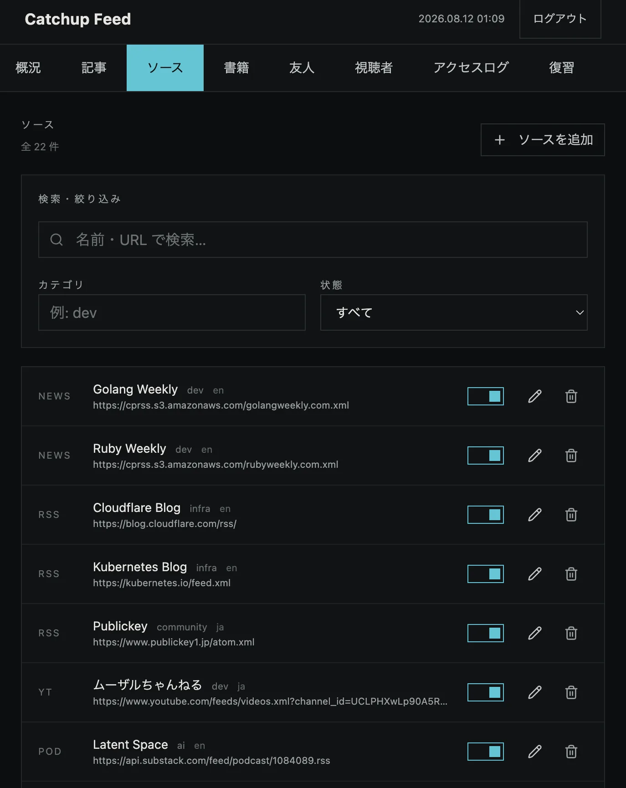
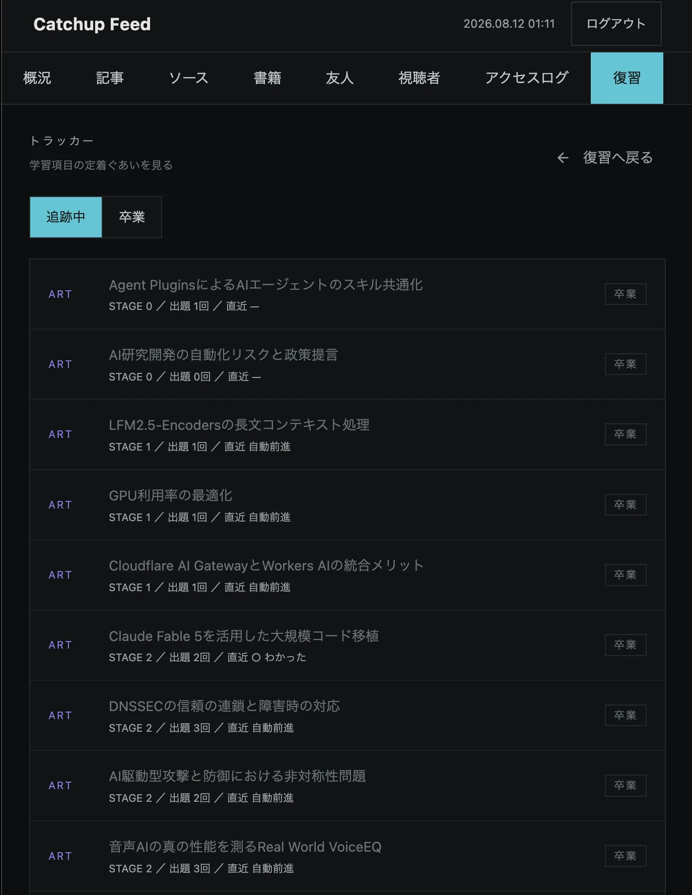
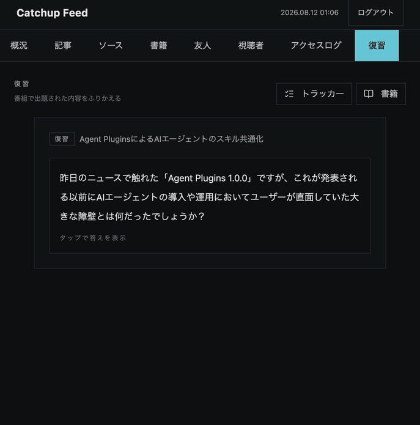

# catchup-feed — 運用ダッシュボード (Frontend)

<p align="center">
  <strong>毎朝10〜15分の音声ラジオ番組をポッドキャストアプリへ配信する、個人向け学習システム「catchup-feed」の運用ダッシュボード</strong>
</p>

<p align="center">
  <a href="#概要">概要</a> •
  <a href="#主な画面機能">画面/機能</a> •
  <a href="#技術スタック">技術スタック</a> •
  <a href="#セットアップ">セットアップ</a> •
  <a href="#api-型生成">API 型生成</a> •
  <a href="#環境変数">環境変数</a> •
  <a href="#テスト">テスト</a>
</p>

---

## 概要

現行の **catchup-feed** は、初代 catchup-feed(ニュースアグリゲータ)の後継システムです。初代は「配信された記事数」を最適化していましたが、Discord・Slack に流れる要約をすべて読むことは負荷が大きいものでした。そこで本システムが最適化するのは **理解の定着** です。可処分時間が細切れで手も目も塞がっている時間帯(移動中・家事中)に消化できるよう、応答形態を **音声** に変えました。RSS を要約し、毎朝10〜15分のラジオ番組(mp3)を生成し、ポッドキャストアプリ経由で本人と友人に届け、フィードバックを得ます。

本リポジトリはそのフロントエンド、すなわち **Next.js 製の PWA 運用ダッシュボード** です。番組の再生 UI ではなく、**運用管理 UI** に特化しています:

- **ソース管理** — クロール対象ソース(RSS / YouTube / ポッドキャスト / ニュースレター)の追加・有効/無効・カテゴリ/言語設定
- **友人(購読者)/トークン管理** — ポッドキャスト購読トークンの発行・失効。購読 URL は発行時に一度だけ表示
- **アクセスログ閲覧** — 誰がいつどのエピソードを取得したか。放置(一定期間アクセスなし)の検知
- **書籍管理** — 書籍 PDF のアップロード・取り込みステータス確認・削除(取り込み本体は Mac の夜間バッチ)
- **学習ループ** — 復習クイズの採点・理解トラッカー・book_review 対象書籍の進行管理
- **閲覧者(viewer)管理** — 友人にソース一覧だけを見せる閲覧専用アカウントの発行・無効化

音声番組の生成・配信そのものはバックエンド([catchup-feed-backend](https://github.com/Tsuchiya2/catchup-feed-backend))が担います。本フロントエンドは、そのバックエンドの管理エンドポイントを叩く画面です。


図のうち本リポジトリが担うのは **左端(何を収集するかの決定)と右端(誰にどう届いたかの確認)**、そして番組で出題されたクイズの採点です。中央の要約・台本生成・音声合成には関与しません。

### 設計原則

- **単一ユーザー右サイズ** — 管理者は 1 名のみ(資格情報は backend の環境変数 + bcrypt。users テーブルを持たない)。過度な分散化・監視/分析基盤を持ち込まない。友人向けの閲覧専用 `viewer` ロールだけが例外で、権限は「アクティブなソース一覧の閲覧」に限定(D-27)
- **認証は HttpOnly cookie** — JWT は backend が `Set-Cookie`(HttpOnly / Secure / SameSite=Strict)で発行し、フロントは `credentials:'include'` で送る。localStorage にトークンを保存しない(D-22)。ルート保護は `src/proxy.ts`(サーバー側)が担い、UI の出し分けだけに頼らない
- **ゼロ円運用** — 新規の固定費を増やさない。Sentry など外部の可観測性 SaaS は削除済み(再導入しない)
- **API 契約はバックエンドが正** — 手書きの API 型を作らず、バックエンドの Swagger から `npm run generate:api` で TypeScript 型を再生成する
- **画面デザインの正は design_handoff** — 親リポジトリの `design_handoff_catchup_feed_console/README.md`(放送卓デザイン)。API が存在しない領域をプレースホルダで描かない(D-35 / D-38 / D-39)。既知の例外は概況の指標タイル `EPISODE` `尺` `要約待ち` の3枚で、D-39(4) が判断を保留し次サイクルの再検討対象として design_handoff §3 に明記している

---

## 主な画面/機能

| ソース管理 `/sources` | 学習トラッカー `/learning/items` |
|:--:|:--:|
|  |  |

番組で出題されたクイズの採点は `/learning` で行います。受け取るのは ○(わかった)/ △(あいまい)/ ×(忘れた)の3値だけで、次の出題日は backend の SRS が決めます。期日超過の警告色や未消化バッジは意図的に持ちません(Phase 3 §8.2「罪悪感 UI の禁止」)。



ナビゲーション(放送卓デザインの 卓 / 入力 / 送出 の 3 グループ)と各画面。すべて認証後:

| グループ | 画面 | パス | 内容 |
|---|------|------|------|
| 卓 | **概況** | `/dashboard` | 明朝の候補(直近クロール記事)と受信状況(友人ごとの最終アクセス・放置検知) |
| 入力 | **記事** | `/articles`, `/articles/[id]` | 収集済み記事の一覧・検索と、要約の閲覧 |
| 入力 | **ソース** | `/sources` | クロール対象の CRUD、有効/無効・種別(RSS / YouTube / ポッドキャスト / ニュースレター)・カテゴリ/言語設定 |
| 入力 | **書籍** | `/books` | 書籍 PDF のアップロード(100MB/冊)・取り込みステータス・削除(D-25) |
| 送出 | **友人** | `/subscribers`, `/subscribers/[id]` | 購読者の管理と購読トークンの発行・失効。無効化は論理削除 |
| 送出 | **視聴者** | `/viewers` | 閲覧専用アカウントの作成・有効/無効・削除(D-27) |
| 送出 | **アクセスログ** | `/access-logs` | 購読者ごとのアクセス概況(放置検知)と時系列ログ。友人単位で絞り込み可 |
| 送出 | **復習** | `/learning`, `/learning/items`, `/learning/books` | 復習クイズの採点(○△×)、理解トラッカー(ステージ・次回予定日)、book_review 対象書籍の activate / deactivate |

ナビ外: `/`(ランディング)、`/login`、`/terms`、`/privacy`。`viewer` ロールでログインした場合は `/sources`(閲覧のみ)だけが見え、他はサーバー側の `proxy.ts` が遮断します。

> **「友人」「視聴者」は何のためにあるか** — 本システムは商用サービスではなく、番組の感想やソース選定のフィードバックを得るための少人数運用です。「友人(subscriber)」はポッドキャストの購読トークンを持つ人、「視聴者(viewer)」は**ソース一覧の閲覧だけができる**アカウントで、記事本文にも要約にも到達できません(D-27)。配信するのはトークンを発行した本人と友人だけで、一般公開・商用配信は行わず、要約には常に原典へのリンクを併記します。同趣旨の利用者向けの記載はアプリ内の `/terms`(3. コンテンツの権利)にもあります。

### トークン発行と一度きり表示

友人詳細画面から購読トークンを発行すると、購読 URL(`https://<feed domain>/feeds/{token}/feed.xml` 形式)が **その場で一度だけ** 表示されます。バックエンドはトークンをハッシュ(SHA-256)で保存するため、平文の URL は二度と取得できません(設計上の決定 D-5)。ダイアログは Escape / 背景クリックで閉じられないようにガードし、「閉じると URL は失われ、再取得はできない(復旧は失効+再発行のみ)」ことを明示します。失効は取り消せない操作であることも UI 上で明示しています。

### PWA / モバイル

ユーザーの主要動線はスマホです。本アプリは [Serwist](https://serwist.pages.dev/) による PWA(Service Worker)対応で、モバイルファーストのレスポンシブ UI を維持します。

---

## 技術スタック

バージョンは `package.json` を正とします(抜粋)。

| カテゴリ | 技術 |
|----------|------|
| **フレームワーク** | [Next.js 16](https://nextjs.org/) (App Router) / [React 19](https://react.dev/) |
| **言語** | [TypeScript 5](https://www.typescriptlang.org/) (Strict) |
| **ランタイム** | Node.js 24 |
| **スタイリング** | [Tailwind CSS 4](https://tailwindcss.com/) |
| **UI コンポーネント** | [Radix UI](https://www.radix-ui.com/) primitives + shadcn/ui スタイル(cva / clsx / tailwind-merge) |
| **アイコン** | [lucide-react](https://lucide.dev/) |
| **データ取得** | [TanStack Query 5](https://tanstack.com/query) |
| **フォーム** | [React Hook Form](https://react-hook-form.com/) + [Zod](https://zod.dev/) |
| **認証** | JWT([jose](https://github.com/panva/jose))— backend 発行の HttpOnly cookie を `proxy.ts` が検証(D-22) |
| **PWA** | [Serwist](https://serwist.pages.dev/) (Service Worker) |
| **テーマ** | [next-themes](https://github.com/pacocoursey/next-themes)(ダークモード) |
| **API 型生成** | [openapi-typescript](https://openapi-ts.pages.dev/) + [swagger2openapi](https://github.com/Mermade/oas-kit)(Swagger 2.0 → OpenAPI 3 変換) |
| **テスト** | [Vitest 4](https://vitest.dev/) + [Testing Library](https://testing-library.com/) + [Playwright](https://playwright.dev/) |
| **UI カタログ** | [Storybook 10](https://storybook.js.org/) |
| **Lint / Format** | [ESLint 9](https://eslint.org/) (flat config) + [Prettier](https://prettier.io/) |

---

## セットアップ

### 前提

- Node.js 24 系
- バックエンド([catchup-feed-backend](https://github.com/Tsuchiya2/catchup-feed-backend))が起動していること(API 型生成・実データ表示に必要)

### ローカル(Node で直接起動)

```bash
git clone https://github.com/Tsuchiya2/catchup-feed-frontend.git
cd catchup-feed-frontend

cp .env.example .env   # 環境変数を用意
npm install
npm run dev            # http://localhost:3000
```

### Docker Compose(任意)

`compose.yml` を使う場合。バックエンドが作成する外部ネットワーク `catchup-feed_backend` が存在している必要があります。

```bash
cp .env.example .env
docker compose up -d
docker compose logs -f web
```

コンテナはポート `3001` で公開されます(`3001:3000` にマッピング)。

### 主なスクリプト

| コマンド | 内容 |
|----------|------|
| `npm run dev` | 開発サーバー起動 |
| `npm run build` / `npm run start` | 本番ビルド / 本番起動(**ビルドは webpack**。Turbopack では `@serwist/next` の Service Worker 生成が走らず PWA が壊れるため、意図的に維持 — D-23) |
| `npm run lint` | ESLint(`--max-warnings 0`。警告ゼロが完了条件) |
| `npm run lint:fix` | ESLint 自動修正 |
| `npm run format` / `npm run format:check` | Prettier 整形 / チェック |
| `npm run generate:api` | Swagger から API 型を再生成 |
| `npm run test` | Vitest(ユニット/統合) |
| `npm run test:coverage` | カバレッジ付きテスト |
| `npm run test:e2e` | Playwright(E2E) |
| `npm run storybook` / `npm run build-storybook` | Storybook 起動 / ビルド |
| `npm run analyze` | バンドル解析ビルド |

---

## API 型生成

API の型は手書きしません。バックエンドの Swagger 定義を正とし、`scripts/generate-api.mjs` が Swagger 2.0 → OpenAPI 3 変換を挟んで TypeScript 型を生成します。

```bash
# バックエンドがローカル起動している場合(既定: http://localhost:8080/swagger/doc.json)
npm run generate:api

# 明示的に spec を指定する場合(URL でもファイルパスでも可)
npm run generate:api -- http://localhost:8080/swagger/doc.json
```

- 生成物: `src/types/generated/api.d.ts`(**手で編集しない**)
- アプリ側で使う読みやすいエイリアスは `src/types/api.d.ts` に置き、生成ファイルから導出します

---

## 環境変数

`.env.example` をコピーして `.env` を作成します。主なもの(全量は `.env.example` を参照):

| 変数 | 既定 / 例 | 用途 |
|------|-----------|------|
| `NODE_ENV` | `development` | 実行環境 |
| `NEXT_PUBLIC_API_URL` | `http://app:8080` | バックエンド API の URL |
| `NEXT_PUBLIC_API_TIMEOUT` | `30000` | API タイムアウト(ms) |
| `NEXT_PUBLIC_API_RETRY_ATTEMPTS` | `3` | API リトライ回数 |
| `NEXT_PUBLIC_API_RETRY_DELAY` | `1000` | リトライ間隔(ms) |
| `NEXT_PUBLIC_APP_NAME` / `NEXT_PUBLIC_APP_SHORT_NAME` | — | アプリ名(メタデータ / PWA マニフェスト) |
| `NEXT_PUBLIC_APP_URL` | — | 公開 URL(メタデータ / OGP) |
| `NEXT_PUBLIC_FEATURE_PWA` | `false` | PWA 機能フラグ |
| `NEXT_PUBLIC_FEATURE_DARK_MODE` | `true` | ダークモード(OS 設定に追従。手動トグルは持たない) |
| `NEXT_PUBLIC_LOG_LEVEL` / `NEXT_PUBLIC_LOG_FORMAT` | `debug` / `pretty` | ロギング |

認証まわりの環境変数はありません。JWT は backend が HttpOnly cookie で発行するため、フロントに保存も更新もありません(D-22。cookie の Domain は backend の `AUTH_COOKIE_DOMAIN`)。

---

## テスト

```bash
npm run test            # Vitest(ユニット/統合)
npm run test:coverage   # カバレッジ
npm run test:e2e        # Playwright(E2E)
npm run storybook       # Storybook でコンポーネントを確認
```

各画面・コンポーネントには Vitest のテストと Storybook のストーリーを添えます。`npm run lint`(警告ゼロ)と `npm run test` の成功が変更の完了条件です。

---

## プロジェクト構成(抜粋)

```
src/
├── app/
│   ├── (auth)/login/               # ログイン
│   ├── (legal)/                    # 利用規約・プライバシー
│   ├── (protected)/                # 認証必須ルート
│   │   ├── dashboard/              # 概況
│   │   ├── articles/               # 記事一覧・詳細
│   │   ├── sources/                # ソース管理
│   │   ├── books/                  # 書籍 PDF 管理(D-25)
│   │   ├── subscribers/            # 友人管理
│   │   │   └── [id]/               # 友人詳細(トークン発行・失効)
│   │   ├── viewers/                # 閲覧専用アカウント管理(D-27)
│   │   ├── access-logs/            # アクセスログ
│   │   └── learning/               # 学習ループ(採点 / items / books)
│   └── api/                        # ルートハンドラ(health / readiness / 記事検索)
├── components/
│   ├── console/                    # 放送卓シェル(レール・タブ・時計)
│   ├── ui/                         # Radix ベースの UI 部品
│   ├── subscribers/ viewers/ books/ learning/ sources/ access-logs/ articles/
│   └── ...
├── hooks/                          # TanStack Query フック
├── lib/                            # API クライアント・セキュリティユーティリティなど
├── proxy.ts                        # ルート保護(cookie 検証・viewer の閉じ込め)
├── sw.ts                           # Serwist の Service Worker 定義
├── types/
│   ├── api.d.ts                    # アプリ用エイリアス
│   └── generated/api.d.ts          # Swagger からの自動生成(編集禁止)
└── ...
```

---

## デプロイ

現状は Vercel で `pulse.catchup-feed.com` として配信し、API はバックエンド(`radio.catchup-feed.com`、Cloudflare Tunnel 経由)を直接叩きます(`NEXT_PUBLIC_API_URL`)。今後、バックエンドが動作する Raspberry Pi 5 上のローカル配信(Tailscale / Cloudflare Tunnel 経由)へ移行予定です。`next build` がスタンドアロンで動く構成を維持します。

> `NEXT_PUBLIC_API_URL` は**ビルド時に CSP の `connect-src` へ焼き込まれる**ため、Vercel 側で値を変えたら再デプロイ(再ビルド)が必要です。env の変更だけでは反映されません。

---

## 関連

- **[catchup-feed-backend](https://github.com/Tsuchiya2/catchup-feed-backend)** — 音声番組の生成・フィード配信・トークン認証を担う Go バックエンド
- **[catchup-feed-ai](https://github.com/Tsuchiya2/catchup-feed-ai)** — 文字起こしと書籍 PDF の取り込み(Python、Mac 夜間バッチ)
- 設計・要件の正は親リポジトリの `docs/pulse-phase1〜3-design.md` / `docs/decisions.md`、画面デザインは `design_handoff_catchup_feed_console/README.md`
- 初代 catchup-feed 期の文書は [docs/legacy/](./docs/legacy/README.md) にアーカイブ済み(参照非推奨)

---

<p align="center">
  Next.js・TypeScript・Tailwind CSS で構築 — 単一ユーザー右サイズ / ゼロ円運用
</p>
