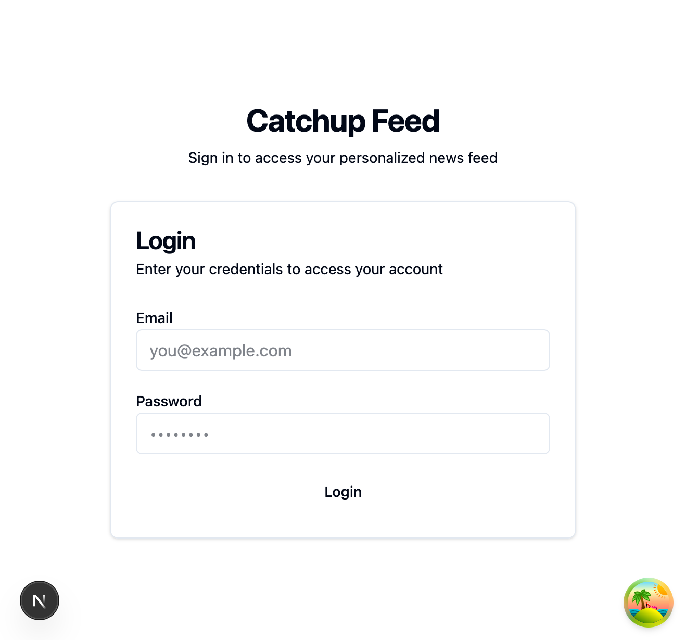

# Article List Pagination - Code Review Report

## Overview

This document summarizes the code review results for the Article List Pagination feature implementation.

**Feature:** Article List Pagination
**Review Date:** 2025-12-07
**Status:** APPROVED (with limitations on UI verification)

---

## Phase 3: Code Review Gate Results

### Code Evaluator Results

All 7 code evaluators were run in parallel. Results:

| Evaluator | Score | Status |
|-----------|-------|--------|
| Code Quality | 8.0/10 | APPROVED |
| Code Testing | 7.5/10 | APPROVED (after test additions) |
| Code Security | 8.0/10 | APPROVED |
| Code Documentation | 7.5/10 | APPROVED |
| Code Maintainability | 8.0/10 | APPROVED |
| Code Performance | 7.5/10 | APPROVED |
| Implementation Alignment | 8.0/10 | APPROVED |

**Average Score:** 7.8/10

### Test Coverage

- **Total Tests:** 81 tests in pagination.test.ts
- **All Tests Passing:** Yes
- **Coverage Areas:**
  - buildPaginationQuery() - 18 tests
  - extractPaginationMetadata() - 18 tests
  - validatePaginationParams() - 15 tests
  - isValidPage() - 15 tests
  - validatePaginatedResponse() - 15 tests

---

## UI/UX Verification

### Screenshots Captured

| Page | Screenshot | Status |
|------|------------|--------|
| Login Page |  | Captured |
| Login Error |  | Captured |

### Verification Notes

**Limitation:** Full UI/UX verification could not be completed due to CORS configuration issues.

- **Issue:** Backend API (localhost:8080) does not allow requests from localhost:3002
- **Reason:** Port 3000 was occupied by Grafana (Docker), requiring frontend to run on port 3002
- **Backend CORS:** Configured to allow only localhost:3000

### Verified Items

1. **Login Page UI** - Displays correctly with:
   - Title: "Catchup Feed"
   - Subtitle: "Sign in to access your personalized news feed"
   - Email input field
   - Password input field
   - Login button

2. **Error Handling** - Connection errors are displayed to users:
   - Error message: "Failed to connect to http://localhost:8080/auth/token"
   - User-friendly error display in the form

### Unverified Items (Due to CORS)

- Articles list page with pagination
- Pagination component interaction
- Page navigation (Previous/Next buttons)
- Page size selector
- Loading states

---

## Implementation Summary

### Files Modified/Created

1. **Type Definitions**
   - `src/types/api.d.ts` - Added PaginationMetadata, PaginatedResponse<T>, ArticlesResponse

2. **Constants**
   - `src/lib/constants/pagination.ts` - PAGINATION_CONFIG with defaults

3. **Utilities**
   - `src/lib/api/utils/pagination.ts` - Utility functions for pagination handling

4. **API Client**
   - `src/lib/api/endpoints/articles.ts` - Updated to handle paginated responses

5. **React Hooks**
   - `src/hooks/useArticles.ts` - Updated for pagination support
   - `src/hooks/useArticleSearch.ts` - Updated for pagination support

6. **UI Components**
   - `src/components/common/Pagination.tsx` - Pagination UI component

7. **Pages**
   - `src/app/(protected)/articles/page.tsx` - Integrated pagination

8. **Tests**
   - `src/lib/api/utils/__tests__/pagination.test.ts` - 81 comprehensive tests

---

## Recommendations

1. **For Full UI Verification:**
   - Either stop Grafana on port 3000 to allow frontend to run there
   - Or update backend CORS configuration to include additional ports

2. **Future Improvements:**
   - Add E2E tests for pagination flow
   - Consider adding keyboard navigation support to pagination

---

## Conclusion

The Article List Pagination feature implementation has passed all code evaluators with an average score of 7.8/10. The implementation follows best practices with comprehensive test coverage (81 tests).

UI/UX verification was partially completed due to CORS configuration limitations. The login page and error handling were verified, but the articles page with pagination could not be tested.

**Final Status:** APPROVED for merge with noted limitations.
